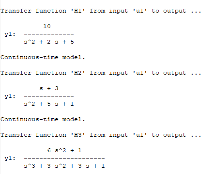

### Questão 1 
## a, b e c
- Código
```matlab

pkg load control

num1 = [10]
den1 = [1,2,5]
f1 = tf(num1,den1)

num2 = [1 3]
den2 = [1,5,1]
f2 = tf(num2,den2)

num3 = [6 0 1]
den3 = [1,3,3,1]
f3 = tf(num3,den3)

display(f1)
display(f2)
display(f3)

```

- Saída


### Questão 2
## a

- Código

```matlab
pkg load control
numg = [-2, -4]
deng = [-3, -5]

k = 10
H = zpk(zeros, poles, k)

display(H)
```

- Saída


## b

- Código

```matlab
pkg load control
numg = [-2, -4]
deng = [-1, -2,-3]
k = 1
H = zpk(zeros, poles, k);

display(H)
```

- Saída


## c

- Código

```matlab
pkg load control
numg = [-2, -4]
deng = [-7, -8,-9]
k = 20
H = zpk(zeros, poles, k);

display(H)
```
- Saída


### Questão 3

- Código

```matlab
pkg load control
pkg load signal

num1 = [10]
den1 = [1,2,5]

num2 = [1 3]
den2 = [1,5,1]

num3 = [6 0 1]
den3 = [1,3,3,1]

[z1, p1, k1] = tf2zp(num1, den1);
H1 = zpk(z1, p1, k1);

[z2, p2, k2] = tf2zp(num2, den2);
H2 = zpk(z2, p2, k2);

[z3, p3, k3] = tf2zp(num3, den3);
H3 = zpk(z3, p3, k3);

display(H1)
display(H2)
display(H3)

```
- Saída



### Questão 4

- Código

```matlab
pkg load control
z1 = [-2; -4]
p1 = [-3;-5]
k1 = 10
[num1, den1] = zp2tf(z1, p1, k1)

z2 = [-2; -4]
p2 = [-1;-2;-3]
k2 = 1
[num2, den2] = zp2tf(z2, p2, k2)

z3 = [-2; -4]
p3 = [-7;-8;-9]
k3 = 20
[num3, den3] = zp2tf(z3, p3, k3)

G1 = tf(num1', den1')
G2 = tf(num2', den2')
G3 = tf(num3', den3')

display(G1)
display(G2)
display(G3)

```
- Saída

